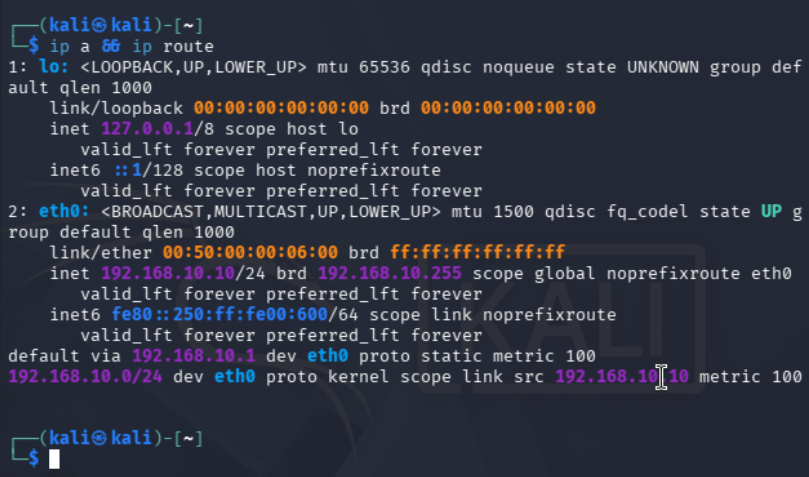
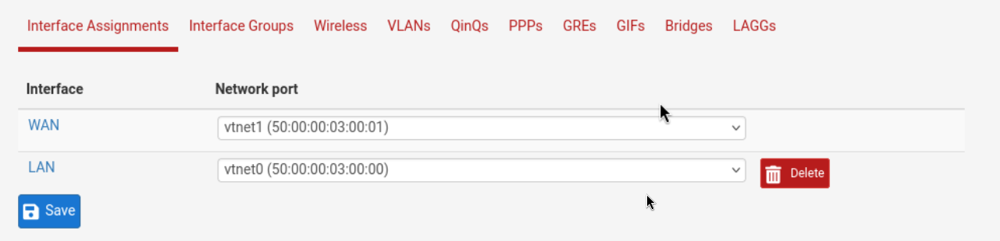
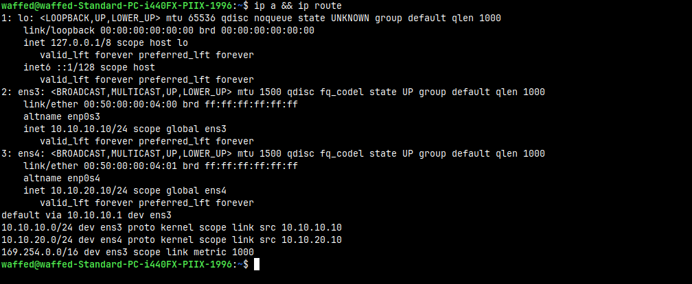
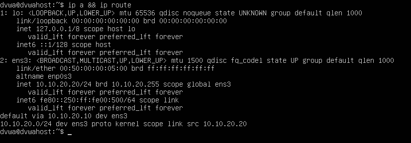

# 02 — Node Setup

This section documents the configuration that was applied to each node before integrating the WAF engine and DVWA application.

## Kali attacker

Kali is placed in the client LAN.

```bash
sudo ip addr flush dev eth0
sudo ip addr add 192.168.10.10/24 dev eth0
sudo ip link set eth0 up
sudo ip route add default via 192.168.10.1
```

Validated state:



Expected result:

```text
eth0: 192.168.10.10/24
default via 192.168.10.1
```

## pfSense interfaces

pfSense has two interfaces:

| pfSense interface | Network port | IP address | Role |
|---|---|---|---|
| LAN | `vtnet0` | `192.168.10.1/24` | client-side gateway |
| WAN | `vtnet1` | `10.10.10.1/24` | WAF-side gateway |

Even though pfSense calls the second interface `WAN`, in this lab it is an internal WAF-side network, not Internet.



## WAF/Zorin machine

The WAF/Zorin machine has two lab interfaces and one optional management interface.

| Interface | IP address | Purpose |
|---|---|---|
| `ens3` | `10.10.10.10/24` | front side, connected to pfSense |
| `ens4` | `10.10.20.10/24` | backend side, connected to DVWA |
| `ens5` | `172.16.42.150/24` | optional management/Internet access |

Permanent NetworkManager configuration used for the lab interfaces:

```bash
sudo nmcli connection modify "Wired connection 1" ipv4.addresses 10.10.10.10/24
sudo nmcli connection modify "Wired connection 1" ipv4.method manual
sudo nmcli connection modify "Wired connection 1" ipv4.never-default yes
sudo nmcli connection modify "Wired connection 1" +ipv4.routes "192.168.10.0/24 10.10.10.1"

sudo nmcli connection modify "Wired connection 2" ipv4.addresses 10.10.20.10/24
sudo nmcli connection modify "Wired connection 2" ipv4.method manual
sudo nmcli connection modify "Wired connection 2" ipv4.never-default yes

sudo nmcli connection up "Wired connection 1"
sudo nmcli connection up "Wired connection 2"
```

Validated state:



## DVWA Ubuntu Server

DVWA is placed on the backend LAN. The backend service is later exposed on port `8000`.

| Interface | IP address | Purpose |
|---|---|---|
| `ens3` | `10.10.20.20/24` | backend connection to WAF |
| `ens4` | `172.16.42.157/24` | optional management/Internet access |

Example backend netplan configuration:

```yaml
network:
  version: 2
  renderer: networkd
  ethernets:
    ens3:
      addresses:
        - 10.10.20.20/24
      routes:
        - to: 10.10.20.0/24
          via: 10.10.20.20
```

Validated state:



## Management cloud note

A management cloud was connected temporarily to install packages and access the Internet from lab nodes. Since DHCP did not answer from the cloud, static management IPs were used.

EVE-NG host:

```text
172.16.42.128/24
```

WAF/Zorin management IP:

```text
172.16.42.150/24
```

DVWA management IP:

```text
172.16.42.157/24
```

On the EVE-NG VM, NAT was enabled for those management addresses:

```bash
sysctl -w net.ipv4.ip_forward=1
iptables -t nat -A POSTROUTING -s 172.16.42.150/32 -o pnet0 -j MASQUERADE
iptables -t nat -A POSTROUTING -s 172.16.42.157/32 -o pnet0 -j MASQUERADE
```

This management connection is not used in the attack path. It is only a practical way to install packages.
