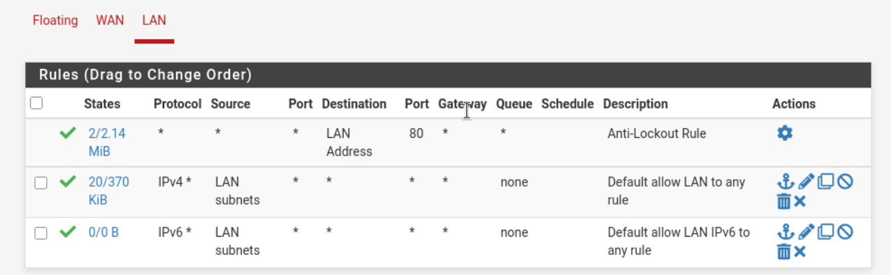
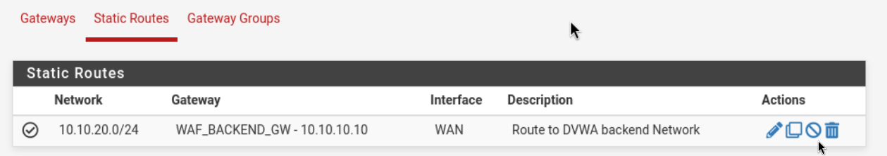
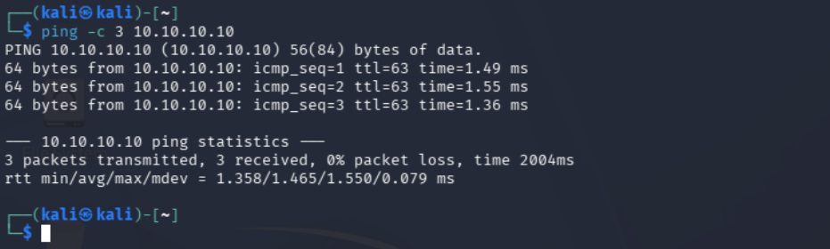
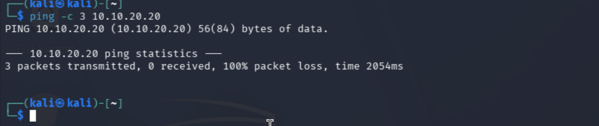
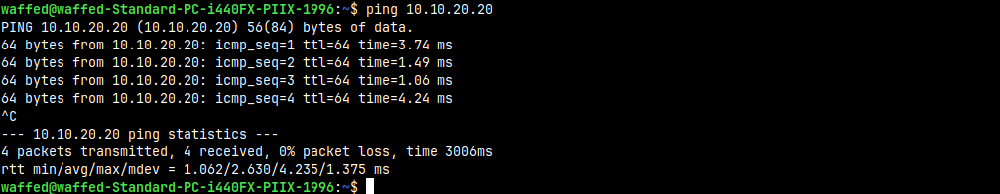

# 03 — pfSense Routing and Access Control

## Objective

pfSense separates the client network from the WAF front network. Its job is to let Kali reach the WAF, while keeping DVWA isolated behind the WAF.

## Interface mapping

| Interface | IP address | Role |
|---|---|---|
| LAN / `vtnet0` | `192.168.10.1/24` | Kali/client side |
| WAN / `vtnet1` | `10.10.10.1/24` | WAF front side |


## Firewall rule correction

A key issue during setup was the LAN rule source. At first, the source was set to `LAN address`, which means only pfSense itself (`192.168.10.1`).

The correct source is:

```text
LAN net
```

That represents the whole client subnet:

```text
192.168.10.0/24
```

After changing the source to `LAN net`, Kali could reach pfSense and the WAF front IP normally.



## Static route to backend network

A route was added so pfSense knows that the backend network is behind the WAF front interface.

| Destination | Gateway |
|---|---|
| `10.10.20.0/24` | `10.10.10.10` |



## Validated routing tests

The following tests were validated before running the full WAF demo.

| Test | Result |
|---|---|
| Kali → pfSense `192.168.10.1` | working |
| Kali → WAF front `10.10.10.10` | working |
| WAF → pfSense `10.10.10.1` | working |
| WAF → DVWA `10.10.20.20` | working |
| DVWA → WAF backend `10.10.20.10` | working |
| Kali → DVWA direct `10.10.20.20` | blocked/unreachable |

Kali reaching the WAF front interface:



Direct Kali access to DVWA failing:



WAF reaching DVWA on the backend network:



## NAT decision

For the security demo, pfSense should not hide Kali behind NAT. The WAF logs are more useful when they show the real client IP.

Expected useful logging:

```text
192.168.10.10 blocked SQLi
```

Bad logging if NAT hides the attacker:

```text
10.10.10.1 blocked SQLi
```

So the lab uses routing and firewall rules, not pfSense NAT between the client side and the WAF side.

## Final policy

The final rule logic is:

| Source | Destination | Port | Action | Reason |
|---|---|---:|---|---|
| Client LAN | WAF front IP | `3333` | allow | clients must reach the WAF engine |
| Client LAN | DVWA backend | `8000` | block | prevents WAF bypass |
| Other unnecessary traffic | any | any | block when strict mode is enabled | reduces noise |

During testing, a more permissive `LAN net -> any` rule was used to validate routing first. After the WAF is stable, the rule set can be tightened to the final policy above.
