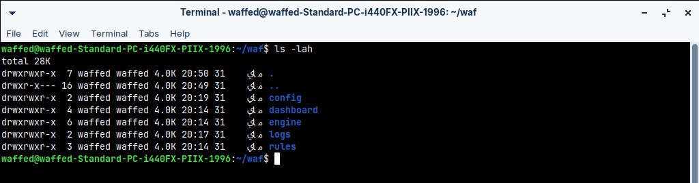
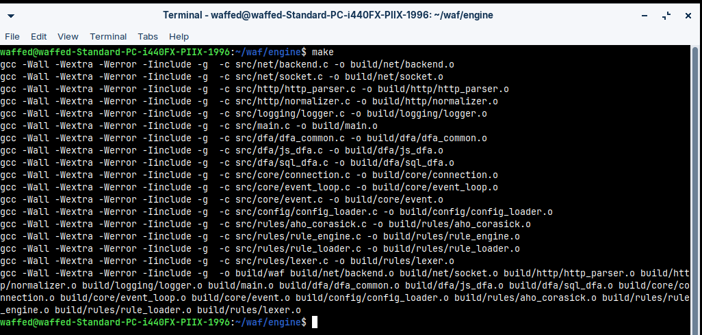
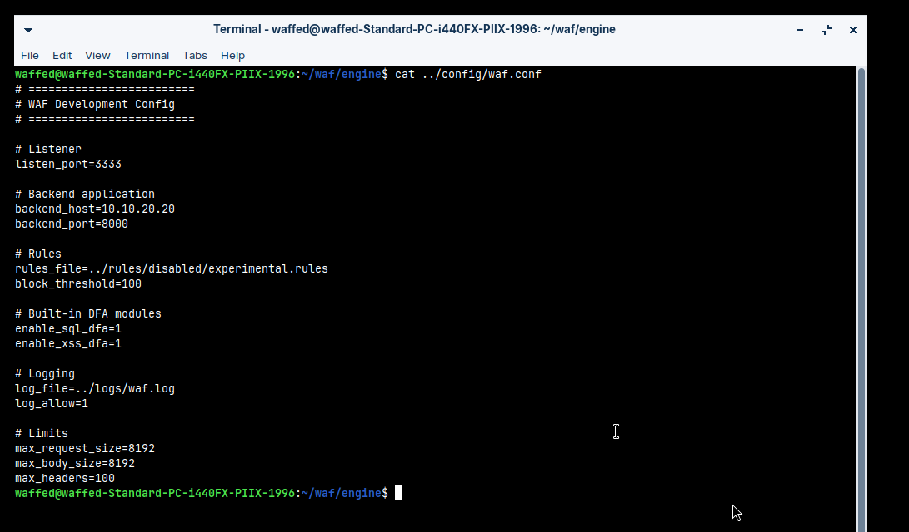
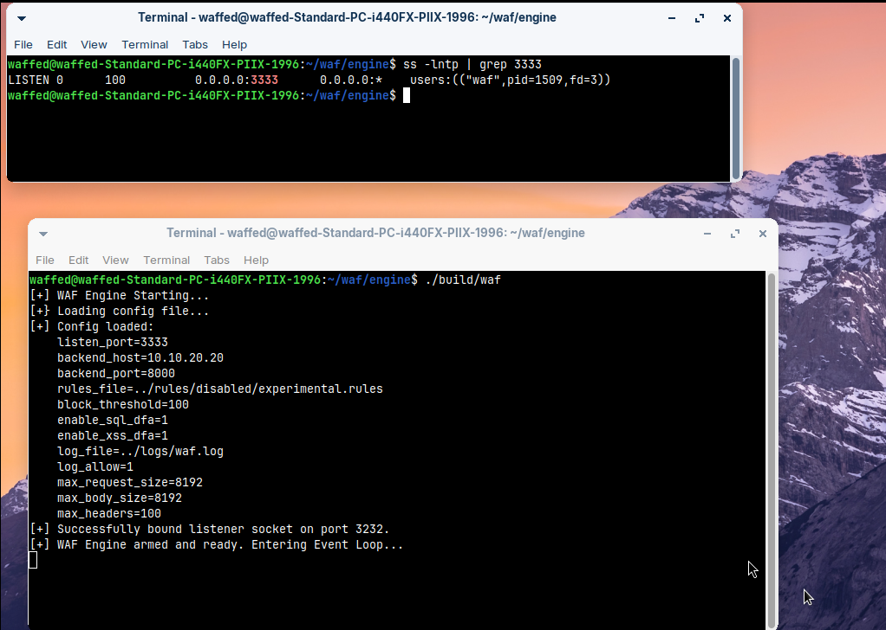
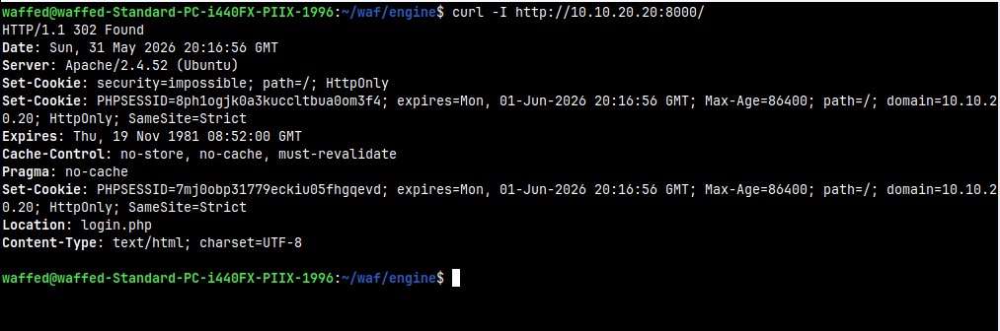
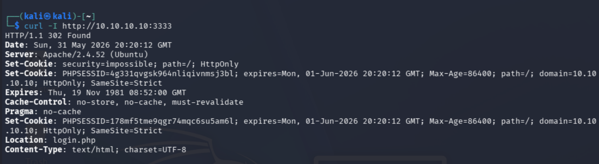
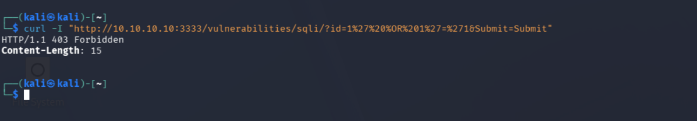
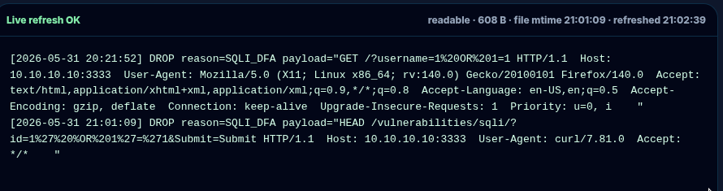

# 04 — WAF Engine Deployment

## Objective

This section documents how the C WAF engine was deployed on the WAF/Zorin machine.

The engine listens on the front-side network and proxies clean traffic to DVWA. Malicious requests are blocked before they reach the backend.

Runtime path:

```text
Kali -> WAF/Zorin:3333 -> DVWA:8000
```

## Project directory

The WAF project is stored on the WAF/Zorin machine.



Expected project structure:

```text
waf/
├── engine/
├── config/
├── rules/
├── logs/
├── dashboard/
└── eve-ng/
```

## Build the engine

From the project root:

```bash
cd ~/waf/engine
make clean
make
```

Successful build evidence:



## Engine configuration

The configuration used in the EVE-NG lab points the WAF to DVWA on port `8000`.

```conf
listen_port=3333
backend_host=10.10.20.20
backend_port=8000
rules_file=../rules/disabled/experimental.rules
block_threshold=100
enable_sql_dfa=1
enable_xss_dfa=1
log_file=../logs/waf.log
log_allow=1
max_request_size=8192
max_body_size=8192
max_headers=100
```



## Run the engine

From the engine directory:

```bash
cd ~/waf/engine
./build/waf ../config/waf.conf
```

Then verify that the process is listening:

```bash
ss -lntp | grep 3333
```



The runtime check with `ss` is the important proof that the WAF is listening on `3333`.

## Verify backend reachability

Before testing attacks, the WAF host must reach DVWA directly through the backend interface:

```bash
curl -I http://10.10.20.20:8000/
```



This proves that the proxy has a reachable backend target.

## Clean request through the WAF

From Kali:

```bash
curl -i http://10.10.10.10:3333/
```



Conclusion: normal traffic is forwarded to DVWA.

## SQL injection request blocked

From Kali:

```bash
curl -i "http://10.10.10.10:3333/vulnerabilities/sqli/?id=1%27%20OR%20%271%27=%271&Submit=Submit"
```



Dashboard/log evidence:



Conclusion: the WAF detects the malicious request and returns a forbidden response before DVWA processes it.

## Reload note

The dashboard edits configuration and rule files, but the C engine loads them at startup. After changing DFA toggles or signatures, restart the engine:

```bash
pkill waf
cd ~/waf/engine
./build/waf ../config/waf.conf
```
