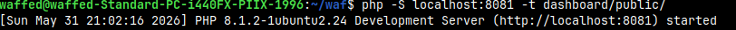
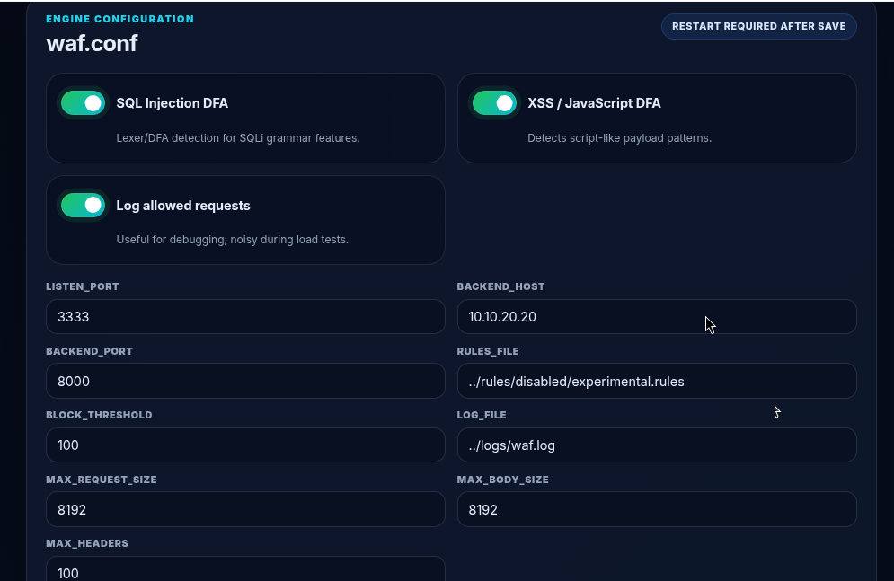
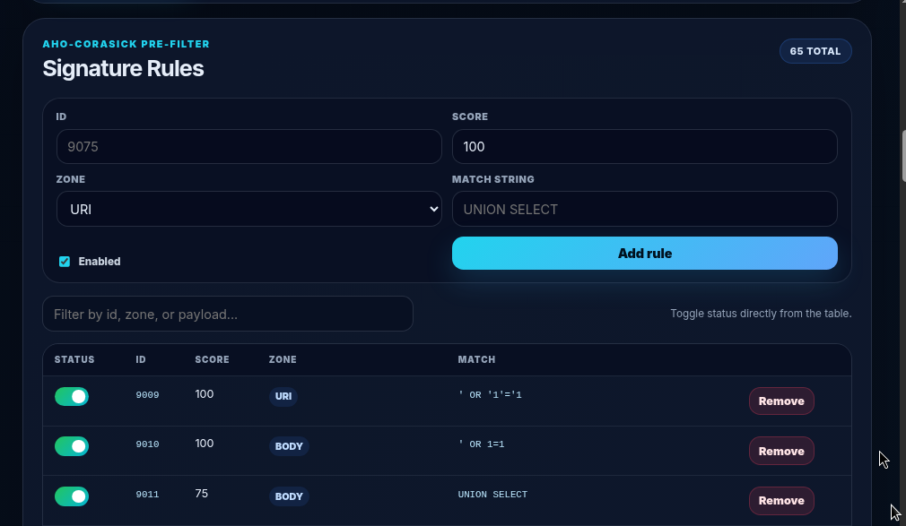

# 05 — PHP Dashboard and Operations

## Objective

The PHP dashboard is a local control panel for the WAF. It is used to inspect the current configuration, manage signatures, toggle DFA options, and watch block logs.

The dashboard is not exposed to Kali. It stays local on the WAF/Zorin machine.

## Local-only design

The dashboard is started with:

```bash
php -S localhost:8081 -t dashboard/public
```

This binds it to `localhost`, so it can be opened only from the Zorin browser:

```text
http://localhost:8081
```

It is intentionally not available at:

```text
http://10.10.10.10:8081
```

This keeps the admin interface private while the WAF engine remains reachable on `10.10.10.10:3333`.

## Start the dashboard

From the project root on WAF/Zorin:

```bash
cd ~/waf
php -S localhost:8081 -t dashboard/public
```

Evidence:



## Verify it is local

On WAF/Zorin:

```bash
ss -lntp | grep 8081
curl -I http://localhost:8081
```

Expected behavior:

```text
Dashboard responds locally on localhost:8081.
It is not exposed on the WAF front interface.
```

## Configuration view

The dashboard shows the active WAF configuration values used by the engine.

Important values:

```conf
listen_port=3333
backend_host=10.10.20.20
backend_port=8000
enable_sql_dfa=1
enable_xss_dfa=1
log_file=../logs/waf.log
```



## Signature rules view

The dashboard also provides a visual interface for the Aho-Corasick signature rules.

Rule format:

```text
rule_id|score|zone|match_string
```

Example:

```text
9075|100|URI|UNION SELECT
```

A disabled rule can be stored as:

```text
#DISABLED|9075|100|URI|UNION SELECT
```



## Log monitoring

The dashboard reads the WAF log file and displays blocked requests with the reason and payload.

Local AJAX endpoint test:

```bash
curl http://localhost:8081/?ajax=logs
```

Live log example:


## Operational workflow

1. Start the C engine on WAF/Zorin.
2. Start the dashboard locally on `localhost:8081`.
3. Send clean and malicious requests from Kali to `10.10.10.10:3333`.
4. Watch the logs from the dashboard on the Zorin browser.
5. If a rule or toggle is changed, restart the C engine.

## Conclusion

The dashboard gives local operational visibility without exposing the admin interface to the attacker network. Kali interacts only with the WAF engine, while the administrator uses the local dashboard on Zorin to manage configuration and inspect logs.
