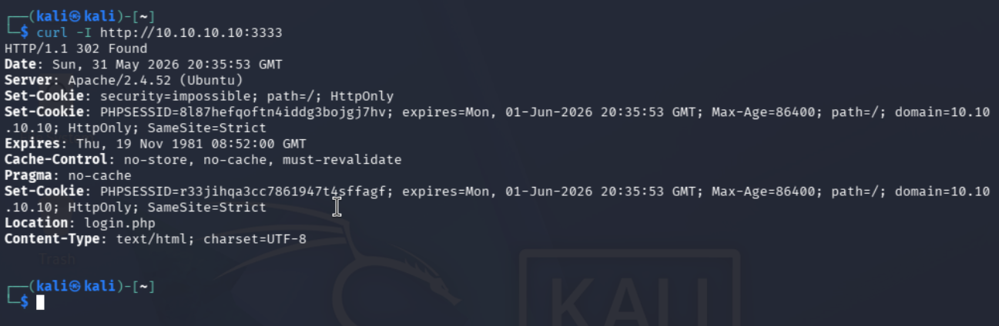
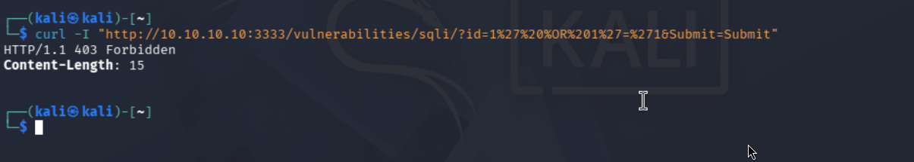
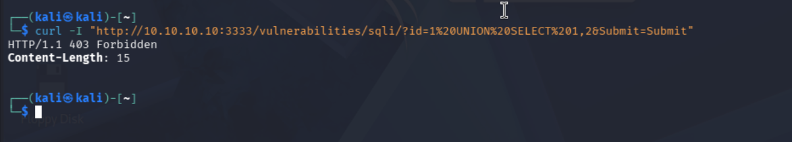
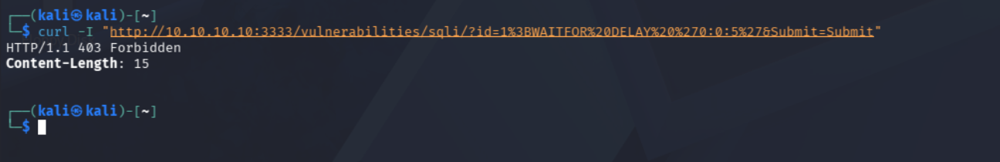
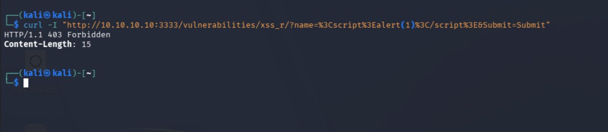
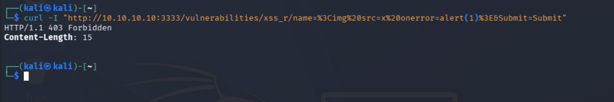
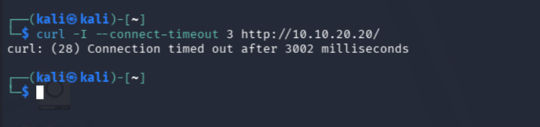
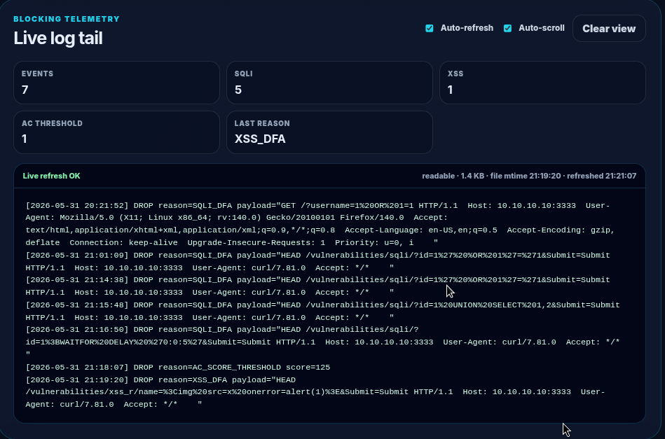

# 06 — Attack Scenarios and Test Cases

## Objective

This section documents the tests used to validate the WAF. The goal is not to exploit DVWA completely. The goal is to prove that dangerous HTTP patterns are stopped before reaching the backend.

All attack traffic is sent through the WAF:

```text
http://10.10.10.10:3333/
```

DVWA itself runs behind the WAF on:

```text
http://10.10.20.20:8000/
```

## Test matrix

| ID | Test | Expected result |
|---|---|---|
| T01 | Clean request | allowed and proxied to DVWA |
| T02 | Basic SQLi | blocked with `403 Forbidden` |
| T03 | UNION SELECT SQLi | blocked |
| T04 | Time-based SQLi | blocked without backend delay |
| T05 | Reflected XSS script tag | blocked |
| T06 | sqlmap user agent | blocked if the signature exists |
| T07 | Direct DVWA access | blocked or timed out |

## T01 — Clean request

Command from Kali:

```bash
curl -i http://10.10.10.10:3333/
```

Evidence:



Conclusion: clean traffic reaches DVWA through the WAF.

## T02 — Basic SQL injection

Command from Kali:

```bash
curl -i "http://10.10.10.10:3333/vulnerabilities/sqli/?id=1%27%20OR%20%271%27=%271&Submit=Submit"
```

Evidence:



Conclusion: the WAF blocks a classic boolean SQL injection pattern.

## T03 — UNION SELECT SQL injection

Command from Kali:

```bash
curl -i "http://10.10.10.10:3333/vulnerabilities/sqli/?id=1%20UNION%20SELECT%201,2&Submit=Submit"
```

Evidence:



Conclusion: the signature/DFA pipeline blocks UNION-style SQL injection.

## T04 — Time-based SQL injection

Command from Kali:

```bash
curl -i "http://10.10.10.10:3333/vulnerabilities/sqli/?id=1%3BWAITFOR%20DELAY%20%270:0:5%27&Submit=Submit"
```

Evidence:



Conclusion: the WAF blocks the request before it can create backend delay.

## T05 — Reflected XSS

Command from Kali:

```bash
curl -i "http://10.10.10.10:3333/vulnerabilities/xss_r/?name=%3Cscript%3Ealert(1)%3C/script%3E"
```

Evidence:



Conclusion: the WAF blocks a classic reflected XSS payload.

## T06 — Scanner user agent

Command from Kali:

```bash
curl -i -A "sqlmap" http://10.10.10.10:3333/
```

Evidence:



Conclusion: scanner indicators can be handled by the signature layer when a matching rule is enabled.

## T07 — Direct DVWA bypass attempt

Command from Kali:

```bash
curl -I --connect-timeout 3 http://10.10.20.20:8000/
```

Evidence:



Conclusion: Kali cannot bypass the WAF and directly access DVWA.

## Log evidence

The dashboard log confirms the WAF detection decisions.



## Final conclusion

The attack tests validate both parts of the design:

1. Clean traffic is still usable through the proxy.
2. SQLi and XSS payloads are blocked before they reach DVWA.
3. Direct backend access from Kali is not allowed.

That combination demonstrates network segmentation plus Layer-7 application inspection.
