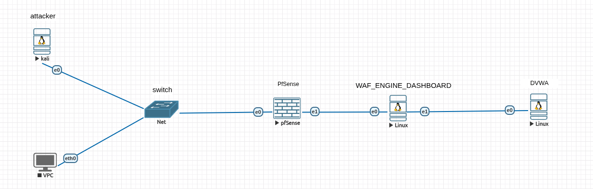

# EVE-NG Lab — C Layer-7 WAF in Front of DVWA

This folder documents the EVE-NG deployment used to demonstrate the C Web Application Firewall project.

The lab is built around one simple security idea: **DVWA must not be reachable directly from the attacker network**. A client request has to pass through pfSense first, then through the C WAF engine, and only clean HTTP traffic is proxied to the DVWA backend.

```text
Kali / Client
      |
pfSense firewall/router
      |
WAF/Zorin machine
  - C WAF engine on 10.10.10.10:3333
  - PHP dashboard local only on localhost:8081
      |
DVWA Ubuntu Server on 10.10.20.20:8000
```

## Files in this folder

| File                                        | Purpose                                                    |
| ------------------------------------------- | ---------------------------------------------------------- |
| `01_topology_and_ip_plan.md`                | Topology, IP plan, and service ports.                      |
| `02_node_setup.md`                          | Node configuration for Kali, pfSense, WAF/Zorin, and DVWA. |
| `03_firewall_routing_and_access_control.md` | pfSense routing, firewall behavior, and validation.        |
| `04_waf_engine_deployment.md`               | Building and running the C WAF engine.                     |
| `05_dashboard_and_operations.md`            | Local-only PHP dashboard usage.                            |
| `06_attack_scenarios.md`                    | Clean request, SQLi, XSS, scanner, and bypass tests.       |
| `assets/`                                   | Renamed screenshots used as evidence.                      |

## Main result

The final demonstration proves three points:

1. **Network segmentation works**: Kali can reach the WAF, but direct access to DVWA is blocked or unreachable.
2. **Reverse proxying works**: clean HTTP traffic sent to `10.10.10.10:3333` is forwarded to DVWA on `10.10.20.20:8000`.
3. **Layer-7 detection works**: SQLi/XSS payloads are blocked by the WAF and visible in the logs/dashboard.


